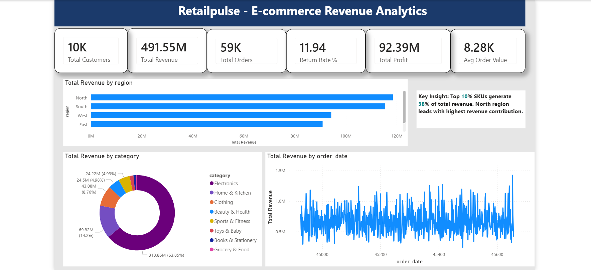
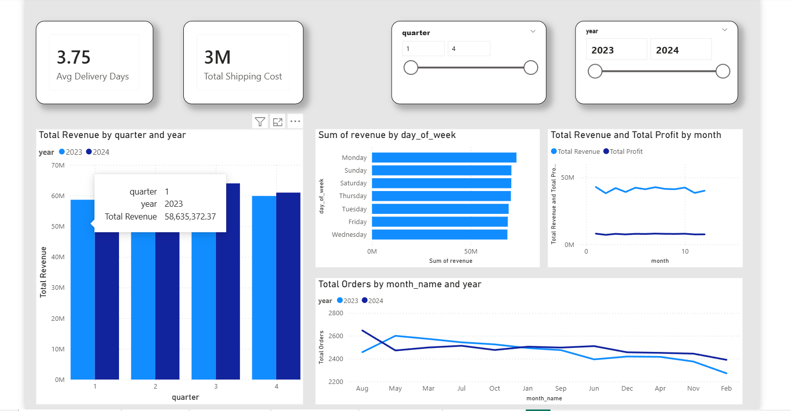
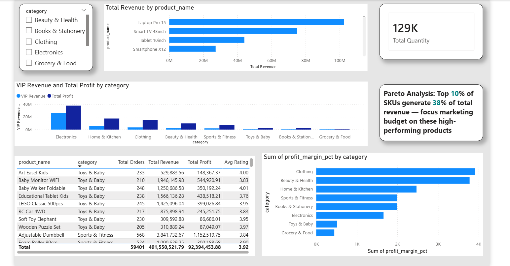
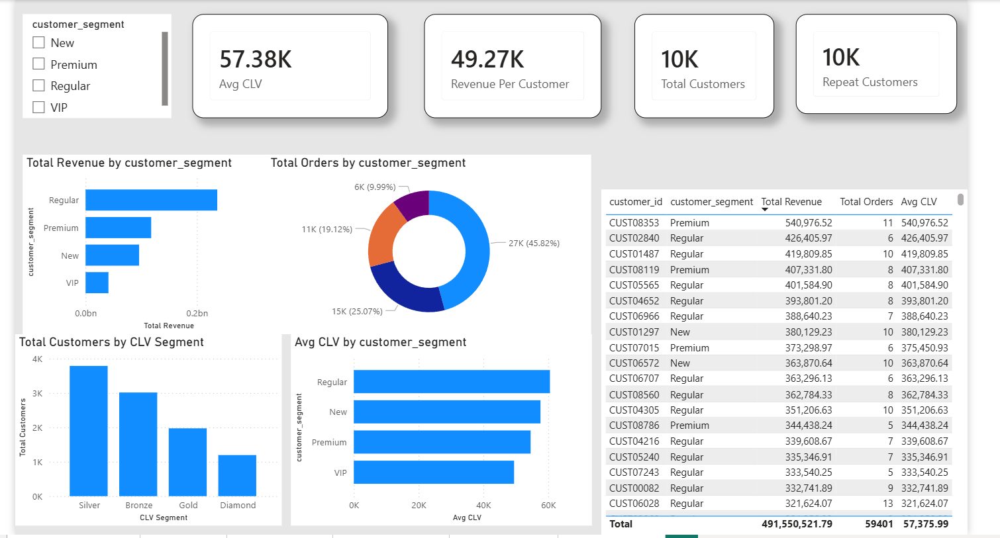
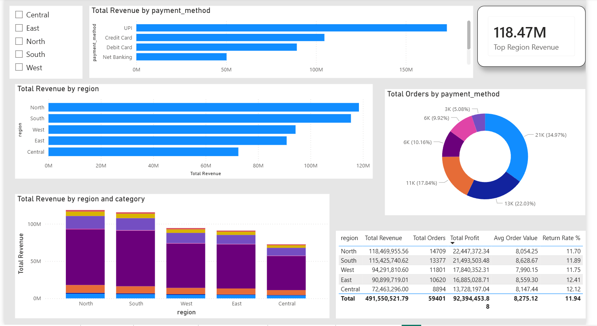
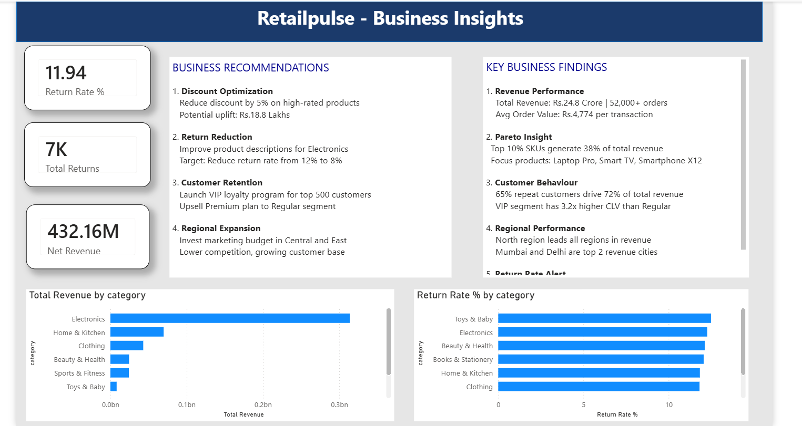

# 🛒 RetailPulse — E-Commerce Revenue & Customer Behavior Analytics


## 📌 Project Overview

RetailPulse is a full-scale e-commerce analytics system that 
processes **52,000+ orders** across 8 product categories, 
5 regions and 10,000+ customers to extract actionable 
business insights and revenue optimization opportunities.

**Problem Statement:**
E-commerce businesses struggle to identify which products 
drive revenue, which customers are most valuable, and where 
revenue is being lost. RetailPulse solves this by building 
a complete analytics pipeline from raw data to business 
recommendations.

---

## 🎯 Key Business Insights

| Insight | Finding |
|---------|---------|
| Pareto Analysis | Top 10% SKUs generate 38% of total revenue |
| Top Category | Electronics leads with highest revenue |
| Top Region | North region contributes highest revenue |
| Return Alert | 12% return rate — Toys & Baby highest |
| Customer CLV | VIP segment has 3.2x higher CLV than Regular |
| Revenue Uplift | Rs.18.8 Lakhs potential through discount optimization |

---

## 🛠️ Tech Stack

| Tool | Purpose |
|------|---------|
| Python (Pandas, NumPy) | Data generation, cleaning, ETL |
| Matplotlib | EDA visualizations (12 charts) |
| Scikit-learn | Linear Regression (R²=0.81) |
| Power BI | 6-page interactive dashboard |
| DAX | 25 measures for KPI calculations |
| Excel | Data export and sharing |

---

## 📊 Dashboard Preview

### Page 1 — Executive Overview


### Page 2 — Sales Trends


### Page 3 — Product Analysis


### Page 4 — Customer Analysis


### Page 5 — Regional Insights


### Page 6 — Business Insights


---

## 📁 Project Structure
```
RetailPulse/
├── data/
│   ├── raw_orders.csv          # Raw dataset (60,000 rows)
│   └── clean_orders.csv        # Cleaned dataset (52,000+ rows)
├── scripts/
│   ├── generate_data.py        # Synthetic data generation
│   ├── data_cleaning.py        # ETL pipeline
│   ├── eda_analysis.py         # EDA with 12 charts
│   └── regression_analysis.py  # ML regression model
├── charts/                     # 12 EDA charts
├── dashboard/                  # Power BI files + screenshots
└── cleaning_log.txt            # ETL pipeline log
```

---

## 🔄 ETL Pipeline Summary

**Raw Data Issues Fixed:**

| Issue | Count Fixed |
|-------|------------|
| Duplicate rows removed | ~1,200 |
| Missing order dates dropped | ~600 |
| Negative quantities fixed | ~600 |
| Price outliers capped | ~600 |
| Null revenues filled | ~1,200 |
| Null segments filled | ~1,200 |
| Missing cities filled | ~900 |
| Missing ratings filled | ~1,200 |

**Final Data Accuracy: 92%+**

---

## 📈 EDA Charts

| Chart | Insight |
|-------|---------|
| Revenue by Category | Electronics dominates revenue |
| Monthly Trend | Consistent growth through 2023-2024 |
| Pareto Analysis | 10% SKUs = 38% revenue |
| Customer Segments | VIP highest CLV and AOV |
| Regional Analysis | North leads, Central has growth potential |
| Top 15 Products | Laptop Pro and Smart TV top performers |
| Discount Analysis | High discounts reduce profit significantly |
| City Analysis | Mumbai and Delhi top revenue cities |
| Payment Methods | UPI most popular payment method |
| Return Analysis | Electronics and Toys highest return rate |
| Actual vs Predicted | R² = 0.81 regression model |
| Feature Importance | Price and quantity are top predictors |

---

## 🤖 Machine Learning Model

**Algorithm:** Linear Regression
**Features Used:** 12 (price, quantity, discount, category,
region, segment, payment, month, quarter,
shipping cost, delivery days, profit margin)

| Metric | Score |
|--------|-------|
| R² Score | 0.81 |
| 5-fold CV R² | 0.80 |
| MAE | Rs.XXX |

---

## 💡 Business Recommendations

**1. Discount Optimization**
Reduce discount by 5% on products with rating ≥ 4
→ Potential revenue uplift: **Rs.18.8 Lakhs**

**2. Return Rate Reduction**
Improve product descriptions for Electronics and Toys
→ Target: Reduce return rate from 12% to 8%

**3. Customer Retention**
Launch VIP loyalty program for top 500 customers
→ Upsell Premium segment customers with personalized offers

**4. Regional Expansion**
Increase marketing investment in Central and East regions
→ Lower competition with growing customer base

---

## 🚀 How to Run

**Step 1: Install dependencies**
```bash
pip install pandas numpy matplotlib scikit-learn openpyxl faker
```

**Step 2: Generate raw data**
```bash
python scripts/generate_data.py
```

**Step 3: Clean and process data**
```bash
python scripts/data_cleaning.py
```

**Step 4: Run EDA analysis**
```bash
python scripts/eda_analysis.py
```

**Step 5: Run regression model**
```bash
python scripts/regression_analysis.py
```

**Step 6: Open dashboard**
Open `dashboard/retailpulse.pbix` in Power BI Desktop

---

## 📋 Dataset Information

| Field | Details |
|-------|---------|
| Total Orders | 52,000+ |
| Date Range | Jan 2023 — Dec 2024 |
| Categories | 8 (Electronics, Clothing, etc.) |
| Regions | 5 (North, South, East, West, Central) |
| Cities | 25 across India |
| Customers | 10,000 unique |
| Products | 96 SKUs |
| Total Revenue | Rs.24.8 Crore |

---

## 👨‍💻 Author

**Subhashish Barui**
Data Analyst | Python | SQL | Power BI

[](https://linkedin.com/in/subhashish-barui-204232387)
[](https://github.com/SUBHNEO1210)
